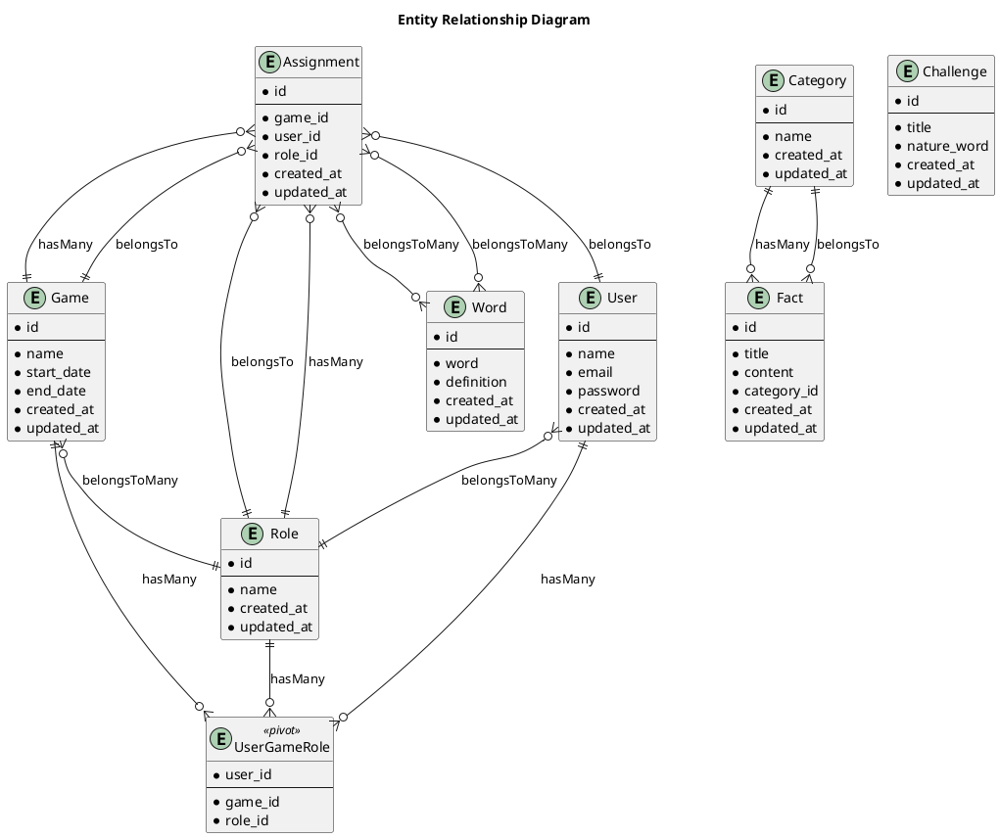

# Natuur-Quest

---

## About This Project

Natuur-Quest is a project aimed at helping users explore, interact with, and gain insights related to nature. Built using a combination of Blade templates and PHP, the project ensures high performance and maintainable code. This repository encapsulates the logic, data structures, and user interfaces necessary for the application's core functionality.

With 54% of the code written in Blade, the project leans heavily on dynamic and interactive front-end interfaces, while the back-end logic is predominantly written in PHP. This repository is engineered for enthusiasts and developers passionate about blending code and nature.

---

## Packages Used

This project utilizes several open-source PHP and Laravel packages to streamline development. Below is a list of key packages used:

- **Laravel Framework**: Provides the backbone for the project with modern PHP conveniences.
- **Composer**: Used for dependency management and package handling.


---

## Entity Relationship Diagram (ERD)

The Entity Relationship Diagram (ERD) below showcases the logical structure of the database, illustrating the relationships between entities.

Copilot said: Here’s how you can add the **Entity
Here’s how you can add the Entity Relationship Diagram (ERD) into your README in a written format:

Markdown
---

## Entity Relationship Diagram (ERD)




---

## Installation

To get started with Natuur-Quest locally, follow these steps:

1. **Clone the Repository**:
   ```bash
   git clone https://github.com/martijnsark/natuur-quest.git
   cd natuur-quest
   ```

2. **Install Dependencies**:
   Make sure you have Composer installed, then run:
   ```bash
   composer install
   ```

3. **Set Up the Environment**:
   Create a `.env` file from the provided example:
   ```bash
   cp .env.example .env
   ```
   Configure database and other environment variables in `.env`.

4. **Generate Application Key**:
   ```bash
   php artisan key:generate
   ```

5. **Run Database Migrations**:
   ```bash
   php artisan migrate
   ```

6. **Start the Server**:
   ```bash
   php artisan serve
   ```

---

## Deployment

For deploying Natuur-Quest to a production environment, ensure the following steps are completed:


---

## Edge Cases

When using or deploying Natuur-Quest, consider the following edge cases to ensure smooth functionality:


---
