# Natuur-Quest
---
A fun web app commissioned by Natuurmonumenten, where families can play a 30-second game with a bonus round as a twist to take photos while out in nature. This web app strives to make exploring nature an enjoyable experience for 12–14-year-olds and their families, while also informing them about the problems nature faces, why nature is important, and how they can help protect it.

---

## About This Project

Natuur-Quest was made at the request of Natuurmonumenten. It focuses on the target audience aged 12–14 and on mobile devices (no support for other devices as of now). Natuur-Quest achieves the following goals of the assignment: connecting users to nature (encouraging users to be in nature), making users aware of nature (why it is important), and promoting green behaviour (simple ways to help nature).

### So, how does it work?
For each game, you will need three players. One will take on the role of “spel leider”; this player essentially acts as the referee, while the other two players compete against each other. Each game has two rounds and one bonus round. During a round, one of the two players will see five random nature-related words. This player needs to explain these words within 30 seconds or less. For each correctly guessed word, they will earn a point, which the “spel leider” will assign after the 30 seconds. The bonus round happens for both players at once: they will be tasked with taking a picture based on one of the five words from the previous round. The best picture will be assigned an additional point.

---

## Packages Used

This project utilizes several open-source PHP and Laravel packages to streamline development. Below is a list of key packages used:

- `fakerphp/faker` (version ^1.23)
- `laravel/breeze`
- `laravel/pail` (version ^1.2.2)
- `laravel/pint` (version ^1.24)
- `laravel/sail` (version ^1.41)
- `mockery/mockery` (version ^1.6)
- `nunomaduro/collision` (version ^8.6)
- `pestphp/pest` (version ^4.1)
- `pestphp/pest-plugin-laravel` (version ^4.0)


---

## Entity Relationship Diagram (ERD)

The Entity Relationship Diagram (ERD) below showcases the logical structure of the database, illustrating the relationships between entities.

```mermaid
erDiagram
    users {
        int id
        string name
        string email
        timestamp email_verified_at
        string password
        string remember_token
        timestamp created_at
        timestamp updated_at
        int balance
    }

    password_reset_tokens {
        string email
        string token
        timestamp created_at
    }

    sessions {
        string id
        int user_id
        string ip_address
        text user_agent
        longText payload
        int last_activity
    }

    cache {
        string key
        mediumText value
        int expiration
    }

    cache_locks {
        string key
        string owner
        int expiration
    }

    jobs {
        int id
        string queue
        longText payload
        tinyint attempts
        int reserved_at
        int available_at
        int created_at
    }

    job_batches {
        string id
        string name
        int total_jobs
        int pending_jobs
        int failed_jobs
        longText failed_job_ids
        mediumText options
        int cancelled_at
        int created_at
        int finished_at
    }

    failed_jobs {
        int id
        string uuid
        text connection
        text queue
        longText payload
        longText exception
        timestamp failed_at
    }

    roles {
        int id
        char name
        timestamp created_at
        timestamp updated_at
    }

    assignments {
        int id
        int game_id
        int role_id
        int user_id
        int score
        boolean active
        timestamp created_at
        timestamp updated_at
    }

    assignment_word {
        int id
        int word_id
        int assignment_id
        timestamp created_at
        timestamp updated_at
    }

    words {
        int id
        char name
        timestamp created_at
        timestamp updated_at
    }

    games {
        int id
        boolean active
        int photo_round_word_id
        int photo_round_winner_user_id
        timestamp photo_round_judged_at
        timestamp created_at
        timestamp updated_at
    }

    game_user {
        int id
        int user_id
        int game_id
        int score
        timestamp created_at
        timestamp updated_at
    }

    user_game_role {
        int id
        int user_id
        int game_id
        int role_id
        timestamp created_at
        timestamp updated_at
    }

    challenges {
        int id
        string title
        string nature_word
        timestamp created_at
        timestamp updated_at
    }

    categories {
        int id
        string name
        timestamp created_at
        timestamp updated_at
    }

    facts {
        int id
        string title
        text content
        int category_id
        timestamp created_at
        timestamp updated_at
    }

    photos {
        int id
        int assignment_id
        int word_id
        string photo
        string original_name
        string mime
        unsignedBigInteger size
        timestamp created_at
        timestamp updated_at
    }

    photo_results {
        int id
        int game_id
        int word_id
        int winner_user_id
        timestamp created_at
        timestamp updated_at
    }

    photo_judgements {
        int id
        int game_id
        int word_id
        int winner_user_id
        timestamp created_at
        timestamp updated_at
    }

    users ||--|| sessions : "has many"
    users ||--o| password_reset_tokens : "has one"
    users ||--o{ game_user : "participates in"
    users ||--o{ user_game_role : "has roles in games"
    users ||--o{ assignments : "can have assignments"
    users ||--o{ photo_results : "can be winner of"
    users ||--o{ photo_judgements : "can be winner of"
    
    games ||--o{ game_user : "includes players"
    games ||--o| assignments : "has assignments"
    games ||--o{ photo_results : "includes results"
    games ||--|{ photo_judgements : "includes judgements"
    
    roles ||--o{ user_game_role : "can be assigned"
    
    assignments ||--|{ assignment_word : "contains words"
    
    categories ||--o{ facts : "has facts"
    
    photos ||--o| assignments : "belongs to assignment"
    photos ||--o| words : "linked to word"
```


---

## Installation

To get started with Natuur-Quest on Windows locally, follow these steps:

1. **Clone the Repository**:
   ```bash
   git clone https://github.com/martijnsark/natuur-quest.git
   cd natuur-quest
   ```

2. **Install Required software**:
    Install composer: [composer-install](https://getcomposer.org/download/)
    Install Phpstorm via jetbrains(Subscription required, important for database) [Jetbrains](https://www.jetbrains.com/idea/download/?section=windows)
    install Laravel herd for local hosting [Laravel Herd](https://herd.laravel.com/docs/windows/getting-started/installation)
   

4. **Install Dependencies**:
   Make sure you have Composer installed, then run:
   ```bash
   composer install
   ```

5. **Set Up the Environment**:
   Create a `.env` file from the provided example:
   ```bash
   cp .env.example .env
   ```
   Configure database and other environment variables in `.env`.

6. **Generate Application Key**:
   ```bash
   php artisan key:generate
   ```

7. **Run Database Migrations**:
   ```bash
   php artisan migrate
   ```

8. **Start the Server**:
   ```bash
   php artisan serve
   ```

---

## Deployment

For deployment instructions, see the [deployment-tle folder](https://github.com/HR-CMGT/PRG05-2025-2026/tree/main/deployment-tle).


---

## Edge Cases

When using or deploying Natuur-Quest, consider the following edge cases to ensure smooth functionality:


---
